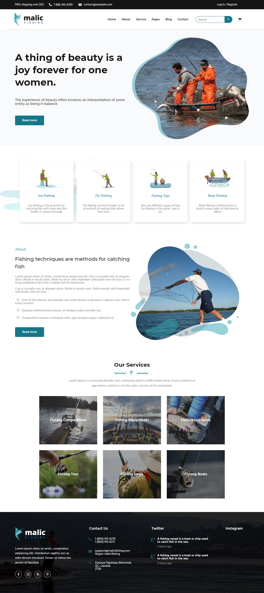

<p align='center'></p>
<h1 align='center'>Desafio Road to Dev Jr - Malic Fishing</h1>
<p align='center'>


</p>

<h3>🔖 Descrição</h3>
<p>Projeto desenvolvido durante o Desafio Road to Dev Jr. oferecida pelos amigos Luciano Gomes e Caio Algusto. O Desafio Road to Dev Jr é uma experiência incrivel, que nos desafia a ir alem dos nossos conhecimentos.<p>

<p>:fish: Malic Fishing Briefing - 'Opa, beleza ? Me chamo Olavo, e estou precisando de um site de pesca, daqueles bem bonitos sabe? Então, procurei na internet e me falaram muito de vocês. Eu queria algo bem bonito, intuitivo, algo bem bacana aos olhos de quem irá acessar, andei pesquisando e achei um modelo que me atraiu bastante, poderia até ser uma página estática. Vou deixar o link aqui embaixo e caso tenha um rapaz desses ai que programa mais experiente, pede pra ele tentar fazer os slides e as animações. Ahh, pode usar as mesmas imagens e icones desse modelo que mandei e quero só a página principal, aquele que abre logo quando clico no site."
<p>


<h3>🚀 Tecnologias</h3>
<ul>
    <li><a href="" target="_blank">Html</a></li>
    <li><a href="" target="_blank">Css</a></li>
    <li><a href="" target="_blank">Javascript Vanilla</a></li>
</ul>

<h3>ℹ️ Como usar</h3>

<h4>ℹ️ Pré-requisitos</h4>

<ul>
    <li><a href="" target="_blank">Git</a></li>
</ul>

<h4>ℹ️ Rodando Projeto</h4>

```bash

# Clone o repositório
$ git clone https://github.com/Diegooliveyra/Malic-Fishing.git

# Acesse a pasta do projeto no terminal
$ cd src/views

# Execute o arquivo
$ index.html

```

<h3>🖼 Layout</h3>



<h3>📝 Licença</h3>
<p>O projeto se encontra sob licença MIT. Para mais detalhes, acesse <a href='LICENSE'>license<a>.</p>
<p>Criado com 💙 por <a href='https://github.com/Diegooliveyra/' target='blank'>Diego Oliveira</a></p>